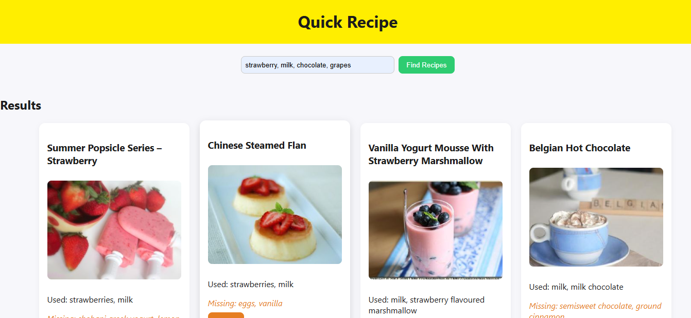
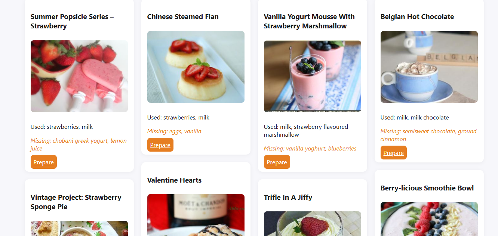
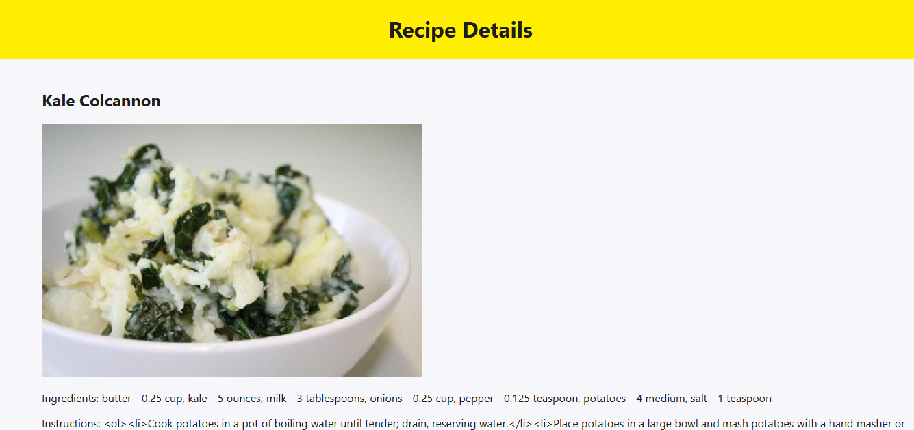
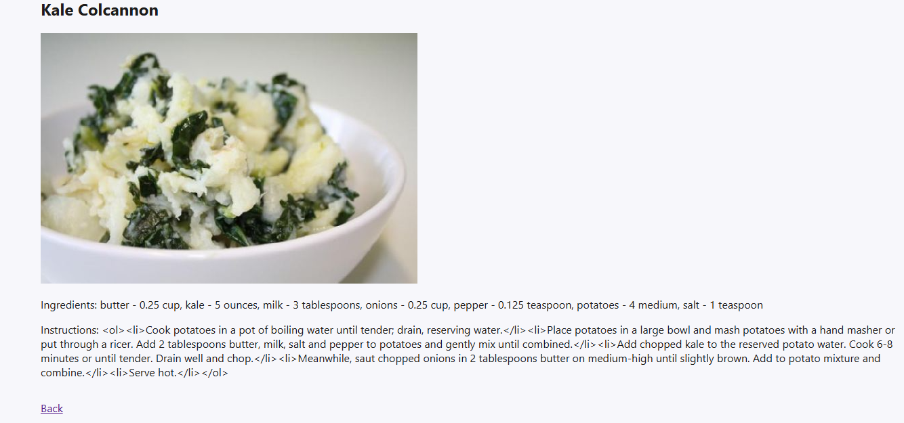
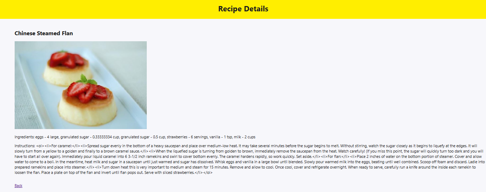

# Quick Recipe App

A simple web app that helps you find recipes based on the ingredients you have at home. Enter your ingredients, see recipe suggestions, and view detailed recipe information including ingredients, instructions, and images.

## Screenshots

1. Recipe Search (Main Page)  
*User enters ingredients and searches for recipes.*


2. Recipe Summary View  
*Shows recipe image and name on the Recipe Details page.*


3. Recipe Instructions View  
*Displays recipe image and instructions.*


4. Full Recipe Zoomed Out  
*All recipe information visible — title, image, and instructions included.*


5. Another Recipe Example  
*Second recipe fully displayed in zoomed out view.*


## Technologies Used
- HTML, CSS, JavaScript
- Masonry.js & imagesLoaded for responsive layout
- Minor AI guidance

## Features
- Search recipes by ingredients
- View recipe details (ingredients, instructions, images)
- Responsive design with Masonry layout for recipe cards
- Easy-to-use interface
- Secure frontend handling to prevent XSS
- Backend securely manages Spoonacular API key

## Installation and Setup
1. Clone the repository:
   ```bash
   git clone https://github.com/talpur456/quick_recipe.git
   cd quick_recipe_frontend
   ```
2. The frontend has no dependencies. Open index.html in your browser.

## Backend Requirement
This frontend requires a backend server that provides recipe data. By default, it expects the backend API to be running and accessible on Railway. The backend securely handles the Spoonacular API key and validates all inputs.

## Usage
1. Enter ingredients in the search box (comma-separated)
2. Click **Find Recipes**. The frontend will request the backend, which fetches recipes from Spoonacular.
3. Click **Prepare** on a recipe card to view recipe details (ingredients, instructions, images).

**Note:** The Spoonacular API has request limits.  
Because of this, the number of recipes returned may be limited.  
At times, you may see no recipes if the API limit has been exceeded.


## Access and Rights
This project is public for **viewing purposes only**.
All rights are **reserved** by **talpur456**.
Do **not copy, modify, fork, or redistribute** this code without explicit permission from the author.

## License
No open-source license is applied. All rights reserved.

## Acknowledgements
Core idea, design, and functionality are original.
